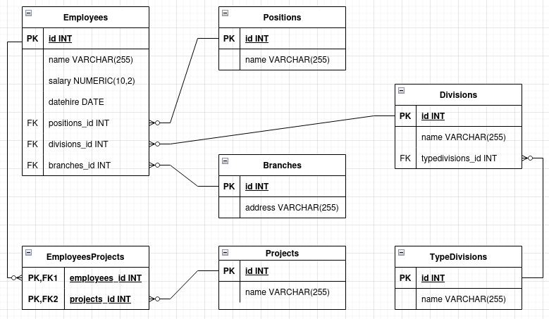
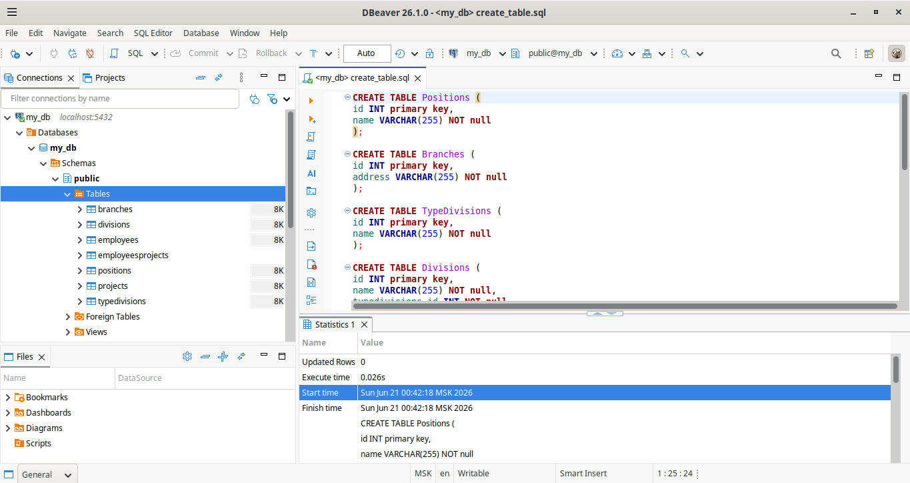

# Домашнее задание к занятию "`Название занятия`" - `Фамилия и имя студента`

### Инструкция по выполнению домашнего задания

   1. Сделайте `fork` данного репозитория к себе в Github и переименуйте его по названию или номеру занятия, например, https://github.com/имя-вашего-репозитория/git-hw или  https://github.com/имя-вашего-репозитория/7-1-ansible-hw).
   2. Выполните клонирование данного репозитория к себе на ПК с помощью команды `git clone`.
   3. Выполните домашнее задание и заполните у себя локально этот файл README.md:
      - впишите вверху название занятия и вашу фамилию и имя
      - в каждом задании добавьте решение в требуемом виде (текст/код/скриншоты/ссылка)
      - для корректного добавления скриншотов воспользуйтесь [инструкцией "Как вставить скриншот в шаблон с решением](https://github.com/netology-code/sys-pattern-homework/blob/main/screen-instruction.md)
      - при оформлении используйте возможности языка разметки md (коротко об этом можно посмотреть в [инструкции  по MarkDown](https://github.com/netology-code/sys-pattern-homework/blob/main/md-instruction.md))
   4. После завершения работы над домашним заданием сделайте коммит (`git commit -m "comment"`) и отправьте его на Github (`git push origin`);
   5. В личном кабинете прикрепите и отправьте ссылку на решение в виде md-файла в вашем Github.
   6. Любые вопросы по выполнению заданий спрашивайте в разделе “Вопросы по заданию” в личном кабинете.
   
Желаем успехов в выполнении домашнего задания!
   
### Дополнительные материалы, которые могут быть полезны для выполнения задания

1. [Руководство по оформлению Markdown файлов](https://gist.github.com/Jekins/2bf2d0638163f1294637#Code)

---

### Задание 1

Описал семь таблиц, из которых состоит база данных. Определил:
    • какие данные хранятся в этих таблицах,
    • какой тип данных у столбцов в этих таблицах, если данные хранятся в PostgreSQL.
Начертил схему полученной модели данных, используя онлайн-редактор: https://app.diagrams.net/
Этапы реализации:
    1. Изучил предоставленный файл с данными и подумал, как можно сгруппировать данные по смыслу.
    2. Разбил исходный файл на несколько таблиц и определил список столбцов в каждой из них.
    3. Для каждого столбца подобрал подходящий тип данных из PostgreSQL.
    4. Для каждой таблицы определил первичный ключ (PRIMARY KEY).
    5. Определил типы связей между таблицами.
    6. Начертил схему модели данных и отобразил на ней: 
    • все таблицы с их названиями, 
    • все столбцы с указанием типов данных, 
    • первичные ключи (явно выделил), 
    • линии, показывающие связи между таблицами. 
Привел скриншот получившейся схемы базы данных как результат выполнения задания.

---

### Задание 2*

    1. Развернул СУБД Postgres в контейнере Docker compose.
    2. Установил DBeaver CE и описал схему, полученную в предыдущем задании, с помощью скрипта SQL.
    3. С помощью DBeaver cоздал в СУБД Postgres новую базу данных и выполнил полученный ранее скрипт. 
В качестве решения приложил SQL скрипт и скриншот диаграммы.

